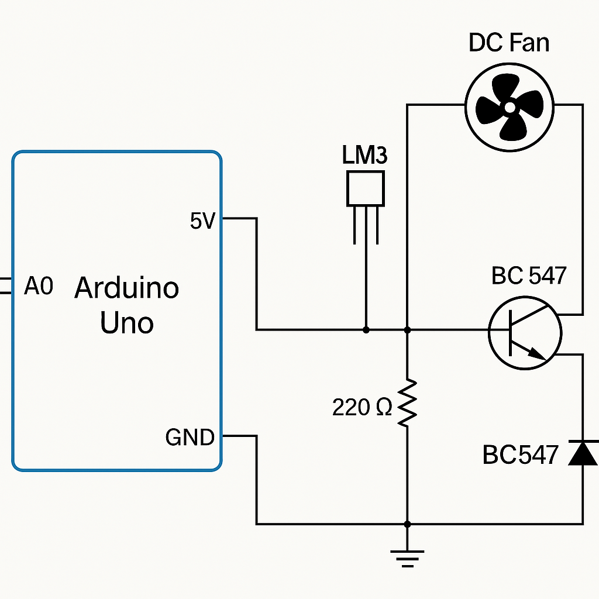

# 🌡️ Automatic Fan Control System using Arduino

A smart embedded system project that automatically controls a fan based on ambient temperature using an LM35 temperature sensor and Arduino UNO.

> 📌 **Project Type**: Embedded Systems | Arduino  
> 🧠 **Skills Used**: C Programming, Analog Sensor Input, PWM Output, Real-Time Control

---

## 🛠️ Components Used

- Arduino UNO
- LM35 Temperature Sensor
- DC Fan (or LED to simulate)
- Transistor (e.g., BC547)
- Resistors
- Power Supply
- Breadboard & Jumper Wires

---

## 🔧 Working Principle

1. LM35 senses the ambient temperature.
2. Arduino reads temperature via analog pin.
3. Based on predefined thresholds, it controls the fan speed using PWM.
4. Real-time adjustment ensures efficient cooling.

---

## 📸 Circuit Diagram

---

## 📂 File Structure

Automatic-Fan-Control/ ├── docs/ │ └── circuit_diagram.png └── project_description.md ├── src └──  main.c ├── test_notes.txt ├── README.md

---

## 🧪 Testing Notes

See [`test_notes.txt`](./test_notes.txt) for test values and behavior under different temperature inputs.

---

## ✨ Features

- Real-time fan speed control
- Clean analog to digital conversion
- Easy to scale and modify
- Simple and low-cost hardware

---

## 📚 Project Description

Read more details in [`Project_description.md`](project_description.md)

---

## 🚀 Future Improvements

- Add LCD to show temperature and fan status
- Add button-based manual override
- Use a servo motor to control fan vent direction

---

## 🙋‍♂️ Author

**Damaraparapu Anideep**  
🔗 [GitHub](https://github.com/ANIDEEPCODE) | [LinkedIn](https://www.linkedin.com/in/damaraparapu-anideep-370638241)

---

⭐ If you liked this project, don’t forget to star the repo!
